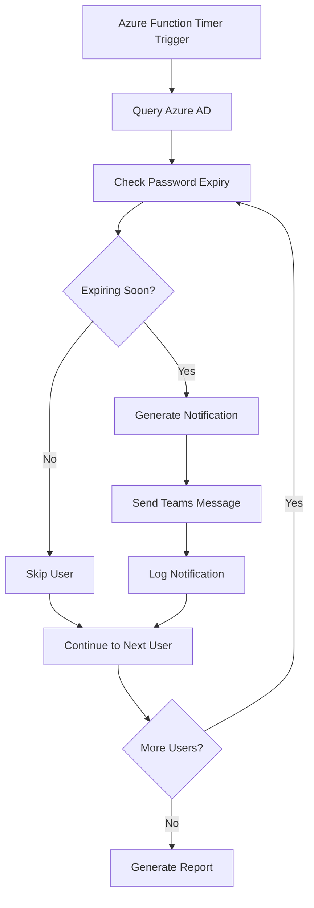

# Password Reminder Bot

<div align="center">


[](https://www.python.org/)
[](https://docs.microsoft.com/en-us/microsoftteams/)
[](https://azure.microsoft.com/en-us/services/functions/)
[](https://github.com/jaquanwatson/Password-Reminder-Bot)
[](LICENSE)

</div>

## 🔑 Overview

Password Reminder Bot is an enterprise-grade solution that automates password expiration notifications through Microsoft Teams, reducing helpdesk tickets by up to 40% while improving security compliance. The system proactively alerts users before their passwords expire, providing direct links to self-service reset portals and customized instructions.

### 🌟 Key Benefits

- **Reduce IT Support Burden**: Decrease password reset tickets by 30-40%
- **Improve Security Compliance**: Ensure timely password updates across the organization
- **Enhance User Experience**: Provide timely, actionable notifications through familiar channels
- **Increase Productivity**: Minimize account lockouts and work disruptions
- **Detailed Analytics**: Track notification effectiveness and user response rates

## ✨ Features

<table>
  <tr>
    <td width="50%">
      <h3>🔔 Smart Notifications</h3>
      <ul>
        <li>Escalating urgency as expiration approaches</li>
        <li>Business hours delivery respecting time zones</li>
        <li>Weekend/holiday-aware scheduling</li>
        <li>Duplicate prevention system</li>
      </ul>
    </td>
    <td width="50%">
      <h3>🌐 Teams Integration</h3>
      <ul>
        <li>Direct personal messages to users</li>
        <li>IT team channel summary reports</li>
        <li>Interactive adaptive cards</li>
        <li>Real-time delivery confirmations</li>
      </ul>
    </td>
  </tr>
  <tr>
    <td>
      <h3>🌍 Multi-language Support</h3>
      <ul>
        <li>English, Spanish, French, German</li>
        <li>Customizable message templates</li>
        <li>Region-specific instructions</li>
        <li>Easy language extension</li>
      </ul>
    </td>
    <td>
      <h3>📊 Compliance & Reporting</h3>
      <ul>
        <li>Notification delivery tracking</li>
        <li>User response monitoring</li>
        <li>Compliance audit reports</li>
        <li>Exception management</li>
      </ul>
    </td>
  </tr>
</table>

## 🖼️ Screenshots & Demo

<div align="center">

### Teams Notification Example


### Admin Dashboard


</div>

## 🛠️ Technical Architecture



## 📋 Prerequisites

- Azure subscription
- Microsoft Teams tenant
- Azure AD permissions:
  - `User.Read.All`
  - `Chat.Create`
  - `TeamsAppInstallation.ReadWriteForUser`
- Python 3.8+

## 🚀 Installation & Setup

### Local Development

```bash
# Clone the repository
git clone https://github.com/jaquanwatson/Password-Reminder-Bot.git
cd Password-Reminder-Bot

# Install dependencies
pip install -r requirements.txt

# Configure environment
cp .env.example .env
# Edit .env with your configuration

# Run locally
python main.py
```

### Azure Functions Deployment

```bash
# Install Azure Functions Core Tools
npm install -g azure-functions-core-tools@4

# Deploy to Azure
func azure functionapp publish your-function-app-name
```

## ⚙️ Configuration

### Environment Variables

```bash
# Azure AD Configuration
AZURE_CLIENT_ID=your-client-id
AZURE_CLIENT_SECRET=your-client-secret
AZURE_TENANT_ID=your-tenant-id

# Teams Bot Configuration
TEAMS_BOT_ID=your-bot-id
TEAMS_BOT_PASSWORD=your-bot-password

# Notification Settings
NOTIFICATION_DAYS=30,14,7,1
DEFAULT_LANGUAGE=en-US
HELPDESK_CONTACT=ext.1234
```

### Notification Schedule

```json
{
  "schedule": "0 0 9 * * *",
  "timezone": "Eastern Standard Time",
  "notifications": [
    {"days": 30, "message_type": "info"},
    {"days": 14, "message_type": "warning"},
    {"days": 7, "message_type": "urgent"},
    {"days": 1, "message_type": "critical"}
  ]
}
```

## 📊 Sample Reports

### Daily Notification Summary

```
Password Reminder Bot - Daily Report
Date: January 8, 2025
=====================================

Notifications Sent: 47
- 30-day reminders: 12
- 14-day reminders: 15
- 7-day reminders: 18
- 1-day reminders: 2

Delivery Status:
- Successfully delivered: 45 (96%)
- Failed deliveries: 2 (4%)

User Actions:
- Passwords reset: 23 (49%)
- Pending action: 24 (51%)

Failed Deliveries:
- user1@company.com (Teams not installed)
- user2@company.com (Account disabled)
```

## 🔒 Security Considerations

- **Secure Storage**: Credentials stored in Azure Key Vault
- **Least Privilege**: Minimal required permissions
- **Audit Logging**: All actions logged for security review
- **Data Privacy**: No password data stored or transmitted
- **Encryption**: All communications encrypted in transit

## 🌐 Multi-language Support

Currently supported languages:

- English (en-US)
- Spanish (es-ES)
- French (fr-FR)
- German (de-DE)

Add new languages by creating message templates in `/locales/`

## 🧩 Advanced Features

### Custom Message Templates

```python
# Custom message for executives
executive_template = {
    "title": "Executive Password Reminder",
    "message": "Your password expires in {days} days. For immediate assistance, contact your dedicated IT support.",
    "priority": "high"
}
```

### Integration with Other Systems

- **ServiceNow**: Create tickets for non-responsive users
- **Slack**: Cross-platform notification support
- **Email**: Fallback notifications via Exchange
- **SMS**: Critical notifications via Twilio

## 🤝 Contributing

We welcome contributions! Please see our [Contributing Guidelines](CONTRIBUTING.md).

### Development Setup

```bash
# Install development dependencies
pip install -r requirements-dev.txt

# Run tests
pytest

# Code formatting
black .
flake8 .
```

## 📄 License

This project is licensed under the MIT License - see the [LICENSE](LICENSE) file for details.

## 👤 Author & Support

**Jaquan Watson** - Cloud & Systems Engineer

- Email: jqwatson96@gmail.com
- LinkedIn: [jaquanwatson](https://linkedin.com/in/jaquanwatson)
- GitHub: [@jaquanwatson](https://github.com/jaquanwatson)

### Acknowledgments

- Microsoft Teams Platform team
- Azure Functions community
- Python-Teams SDK contributors

---

<div align="center">

⭐ **Star this repo if it helped you!** ⭐

Built with ❤️ for better IT security

</div>